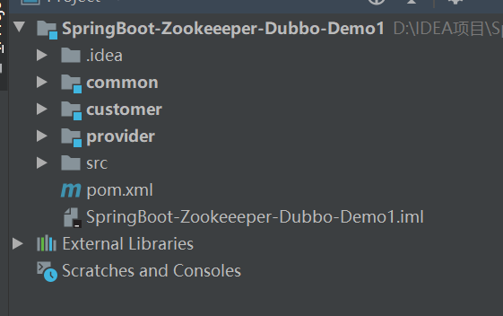
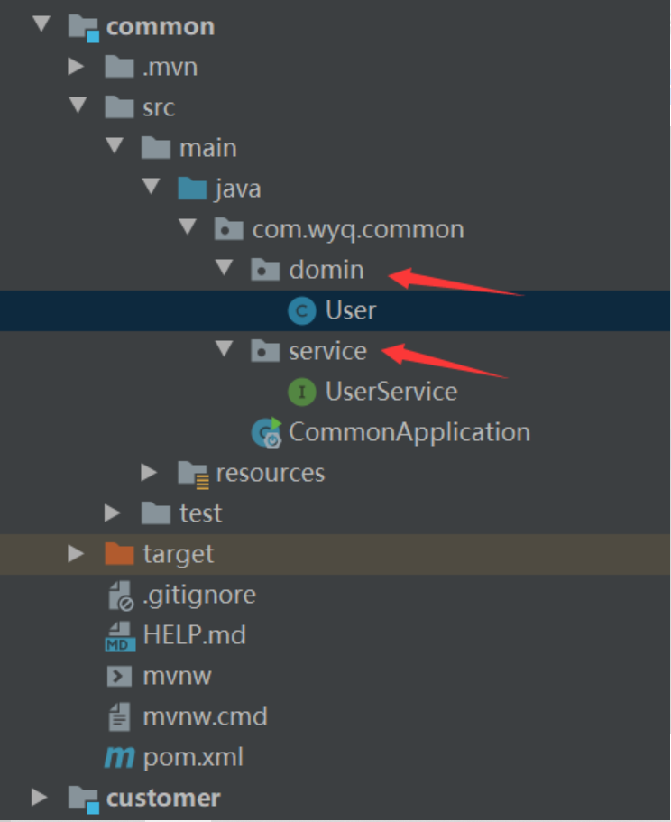
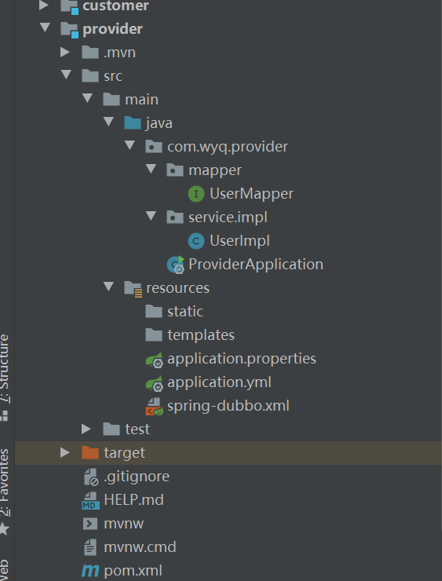
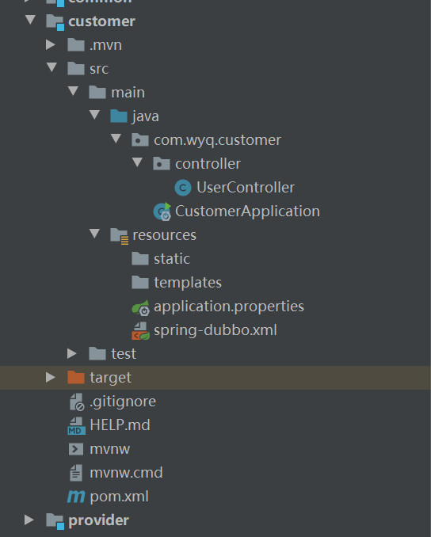
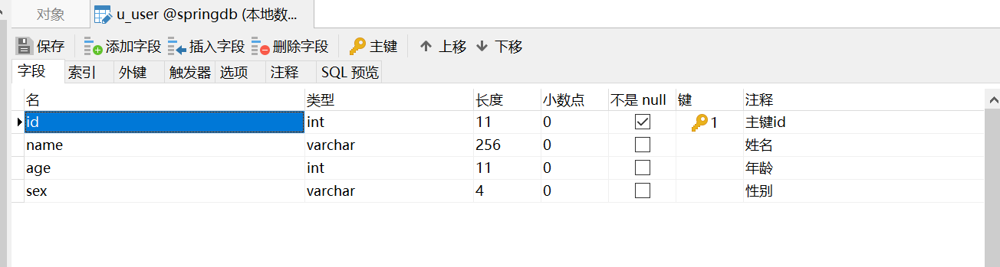
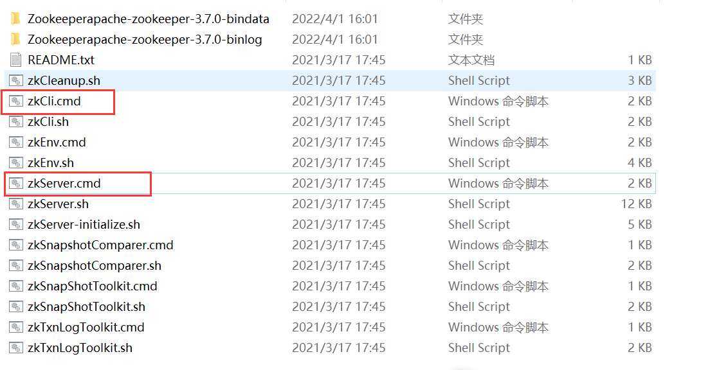
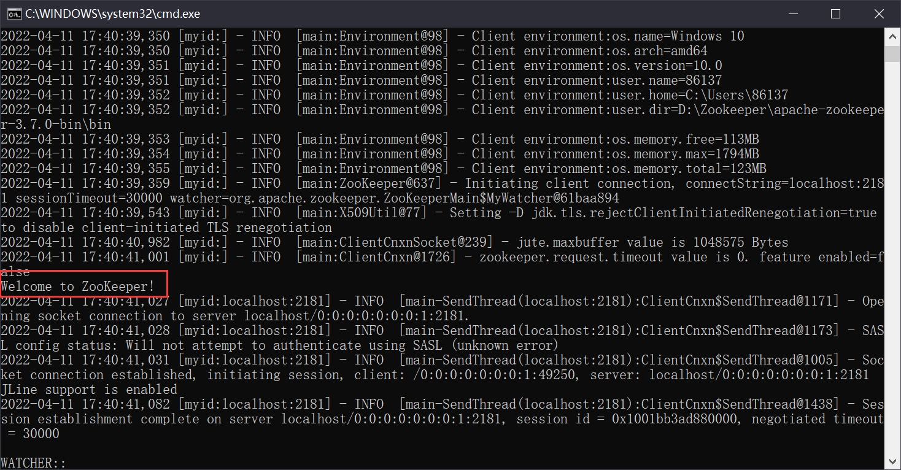
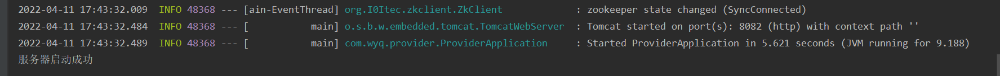
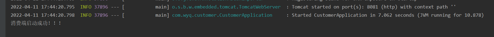
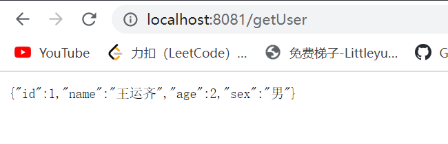

# 一 安装zookeeper

首先在自己本地下载一个zookeeper，安装参考链接：

https://blog.csdn.net/qq_33316784/article/details/88563482?ops_request_misc=%257B%2522request%255Fid%2522%253A%2522164882352316781683916954%2522%252C%2522scm%2522%253A%252220140713.130102334..%2522%257D&request_id=164882352316781683916954&biz_id=0&utm_medium=distribute.pc_search_result.none-task-blog-2~all~baidu_landing_v2~default-3-88563482.142%5Ev5%5Epc_search_result_control_group,157%5Ev4%5Econtrol&utm_term=zookeeper%E5%AE%89%E8%A3%85windows&spm=1018.2226.3001.4187

# 二 搭建SpringBoot项目

## 2.1 项目结构

新建一个maven项目，项目目录如下。



再在该父项目中创建3个module,分别是：provider（服务端）、customer（消费端）、common（存放所有接口和实体类）

## 2.2 主项目配置

主项目的pom.xml文件中添加相应的依赖。

```xml
<?xml version="1.0" encoding="UTF-8"?>
 
<project xmlns="http://maven.apache.org/POM/4.0.0" xmlns:xsi="http://www.w3.org/2001/XMLSchema-instance"
  xsi:schemaLocation="http://maven.apache.org/POM/4.0.0 http://maven.apache.org/xsd/maven-4.0.0.xsd">
  <modelVersion>4.0.0</modelVersion>
 
  <groupId>com.wyq</groupId>
  <artifactId>SpringBoot-Zookeeeper-Dubbo-Demo1</artifactId>
  <version>1.0-SNAPSHOT</version>
  <packaging>jar</packaging>
 
  <name>SpringBoot-Zookeeeper-Dubbo-Demo1 Maven Webapp</name>
  <!-- FIXME change it to the project's website -->
  <url>http://www.example.com</url>
 
  <parent>
    <groupId>org.springframework.boot</groupId>
    <artifactId>spring-boot-starter-parent</artifactId>
    <version>2.0.4.RELEASE</version>
    <relativePath/> <!-- lookup parent from repository -->
  </parent>
 
  <modules>
    <!-- 服务消费者工程 -->
    <module>customer</module>
    <!--  服务提供者工程-->
    <module>provider</module>
    <!-- 主要放实体、接口、也可以放一些公用的工具类工程-->
    <module>common</module>
  </modules>
 
  <properties>
    <project.build.sourceEncoding>UTF-8</project.build.sourceEncoding>
    <project.reporting.outputEncoding>UTF-8</project.reporting.outputEncoding>
    <java.version>1.8</java.version>
    <dubbo.version>2.5.5</dubbo.version>
    <zkclient.version>0.10</zkclient.version>
    <lombok.version>1.16.18</lombok.version>
    <spring-boot.version>1.5.7.RELEASE</spring-boot.version>
  </properties>
 
  <dependencies>
    <dependency>
      <groupId>org.springframework.boot</groupId>
      <artifactId>spring-boot-starter</artifactId>
      <version>${spring-boot.version}</version>
    </dependency>
 
    <dependency>
      <groupId>org.springframework.boot</groupId>
      <artifactId>spring-boot-starter-web</artifactId>
    </dependency>
 
    <dependency>
      <groupId>org.springframework.boot</groupId>
      <artifactId>spring-boot-starter-test</artifactId>
      <scope>test</scope>
    </dependency>
 
    <!-- 使用lombok实现JavaBean的get、set、toString、hashCode、equals等方法的自动生成  -->
    <dependency>
      <groupId>org.projectlombok</groupId>
      <artifactId>lombok</artifactId>
      <version>${lombok.version}</version>
      <scope>provided</scope>
    </dependency>
 
    <!-- Dubbo依赖 -->
    <dependency>
      <groupId>com.alibaba</groupId>
      <artifactId>dubbo</artifactId>
      <version>${dubbo.version}</version>
      <exclusions>
        <exclusion>
          <groupId>log4j</groupId>
          <artifactId>log4j</artifactId>
        </exclusion>
      </exclusions>
    </dependency>
 
    <!--zookeeper的客户端依赖-->
    <dependency>
      <groupId>com.101tec</groupId>
      <artifactId>zkclient</artifactId>
      <version>${zkclient.version}</version>
    </dependency>
  </dependencies>
 
  <build>
    <plugins>
      <plugin>
        <groupId>org.apache.maven.plugins</groupId>
        <artifactId>maven-compiler-plugin</artifactId>
        <configuration>
          <source>${java.version}</source>
          <target>${java.version}</target>
          <encoding>UTF-8</encoding>
        </configuration>
 
      </plugin>
      <plugin>
        <groupId>org.apache.maven.plugins</groupId>
        <artifactId>maven-resources-plugin</artifactId>
        <configuration>
          <encoding>UTF-8</encoding>
        </configuration>
      </plugin>
    </plugins>
  </build>
</project>
```

## 2.3 common配置

- 首先是pom.xml，如下：

```xml
<?xml version="1.0" encoding="UTF-8"?>
<project xmlns="http://maven.apache.org/POM/4.0.0" xmlns:xsi="http://www.w3.org/2001/XMLSchema-instance"
         xsi:schemaLocation="http://maven.apache.org/POM/4.0.0 https://maven.apache.org/xsd/maven-4.0.0.xsd">
    <modelVersion>4.0.0</modelVersion>
    <parent>
        <groupId>org.springframework.boot</groupId>
        <artifactId>spring-boot-starter-parent</artifactId>
        <version>2.0.4.RELEASE</version>
        <relativePath/> <!-- lookup parent from repository -->
    </parent>
 
    <groupId>com.wyq</groupId>
    <artifactId>common</artifactId>
    <version>0.0.1-SNAPSHOT</version>
    <packaging>jar</packaging>
 
    <name>common</name>
    <description>Demo project for Spring Boot</description>
 
    <properties>
        <project.build.sourceEncoding>UTF-8</project.build.sourceEncoding>
        <project.reporting.outputEncoding>UTF-8</project.reporting.outputEncoding>
        <java.version>1.8</java.version>
    </properties>
 
    <dependencies>
        <dependency>
            <groupId>org.springframework.boot</groupId>
            <artifactId>spring-boot-starter-web</artifactId>
        </dependency>
 
        <dependency>
            <groupId>org.springframework.boot</groupId>
            <artifactId>spring-boot-starter-test</artifactId>
            <scope>test</scope>
        </dependency>
        <dependency>
            <groupId>org.junit.jupiter</groupId>
            <artifactId>junit-jupiter</artifactId>
            <version>RELEASE</version>
            <scope>test</scope>
        </dependency>
    </dependencies>
 
    <build>
        <plugins>
            <plugin>
                <groupId>org.springframework.boot</groupId>
                <artifactId>spring-boot-maven-plugin</artifactId>
            </plugin>
        </plugins>
    </build>
 
</project>
```

- 在common下创建domin（放实体类）和service（放接口）两个文件夹



- 在domin中创建User.java实体类

> 这里有一个坑，就是该实体类一定要实现java.io.Serializable这个接口，否则会报错这是因为一个类只有实现了Serializable接口，它的对象才是可序列化的。如果要序列化某些类的对象，这些类就必须实现Serializable接口。而实际上，Serializable是一个空接口，没有什么具体内容，它的目的只是简单的标识一个类的对象可以被序列化。这是我踩过的一个坑，大家可以试着把implements Serializable 去掉，肯定会报错的，报错中会有一句Serialized class com.yykj.mall.dto.ProductListItemDTO must implement java.io.Serializable 

```java
package com.wyq.common.domin;
 
import java.io.Serializable;
 
/**
 * @ClassName User
 * @Description: //TODO 实体类
 * @Author wyq
 * @Date 2022/4/1 18:15
 */
public class User implements Serializable {
    private int id;
 
    private  String name;
 
    private  int age;
 
    private String sex;
 
    public int getId() {
        return id;
    }
 
    public void setId(int id) {
        this.id = id;
    }
 
    public String getName() {
        return name;
    }
 
    public void setName(String name) {
        this.name = name;
    }
 
    public int getAge() {
        return age;
    }
 
    public void setAge(int age) {
        this.age = age;
    }
 
    public String getSex() {
        return sex;
    }
 
    public void setSex(String sex) {
        this.sex = sex;
    }
}
```

- 在service中创建UserService接口：

```java
package com.wyq.common.service;
 
import com.wyq.common.domin.User;
 
/**
 * @ClassName UserService
 * @Description: //TODO
 * @Author wyq
 * @Date 2022/4/1 18:17
 */
public interface UserService {
    User findUser();
}
```

## 2.4 provider配置（提供者）

目录如下：



- pom.xml添加依赖：

```xml
<?xml version="1.0" encoding="UTF-8"?>
<project xmlns="http://maven.apache.org/POM/4.0.0" xmlns:xsi="http://www.w3.org/2001/XMLSchema-instance"
         xsi:schemaLocation="http://maven.apache.org/POM/4.0.0 https://maven.apache.org/xsd/maven-4.0.0.xsd">
    <modelVersion>4.0.0</modelVersion>
    <parent>
        <groupId>org.springframework.boot</groupId>
        <artifactId>spring-boot-starter-parent</artifactId>
        <version>2.0.4.RELEASE</version>
        <relativePath/> <!-- lookup parent from repository -->
    </parent>
 
    <groupId>com.wyq</groupId>
    <artifactId>provider</artifactId>
    <version>0.0.1-SNAPSHOT</version>
    <packaging>jar</packaging>
 
    <name>provider</name>
    <description>Demo project for Spring Boot</description>
 
    <properties>
        <project.build.sourceEncoding>UTF-8</project.build.sourceEncoding>
        <project.reporting.outputEncoding>UTF-8</project.reporting.outputEncoding>
        <java.version>1.8</java.version>
        <zkclient.version>0.10</zkclient.version>
    </properties>
 
    <dependencies>
        <dependency>
            <groupId>com.wyq</groupId>
            <artifactId>common</artifactId>
            <version>0.0.1-SNAPSHOT</version>
        </dependency>
 
        <dependency>
            <groupId>org.springframework.boot</groupId>
            <artifactId>spring-boot-starter</artifactId>
        </dependency>
 
        <dependency>
            <groupId>org.springframework.boot</groupId>
            <artifactId>spring-boot-starter-test</artifactId>
            <scope>test</scope>
        </dependency>
 
        <dependency>
            <groupId>com.alibaba</groupId>
            <artifactId>dubbo</artifactId>
            <version>2.5.5</version>
            <exclusions>
                <exclusion>
                    <groupId>log4j</groupId>
                    <artifactId>log4j</artifactId>
                </exclusion>
            </exclusions>
        </dependency>
 
        <!--zookeeper的客户端依赖-->
        <dependency>
            <groupId>com.101tec</groupId>
            <artifactId>zkclient</artifactId>
            <version>${zkclient.version}</version>
        </dependency>
 
        <dependency>
            <groupId>org.mybatis.spring.boot</groupId>
            <artifactId>mybatis-spring-boot-starter</artifactId>
            <version>1.3.1</version>
        </dependency>
        <dependency>
            <groupId>org.springframework.boot</groupId>
            <artifactId>spring-boot-starter-jdbc</artifactId>
        </dependency>
        <dependency>
            <groupId>mysql</groupId>
            <artifactId>mysql-connector-java</artifactId>
            <version>5.1.35</version>
        </dependency>
        <!-- alibaba的druid数据库连接池 -->
        <dependency>
            <groupId>com.alibaba</groupId>
            <artifactId>druid</artifactId>
            <version>1.0.11</version>
        </dependency>
 
    </dependencies>
 
    <build>
        <plugins>
            <plugin>
                <groupId>org.springframework.boot</groupId>
                <artifactId>spring-boot-maven-plugin</artifactId>
            </plugin>
        </plugins>
    </build>
 
</project>
```

- 配置yml文件，连接数据库，端口号(**application.yml**)

```yml
server:
  port: 8082
  servlet:
    context-path: /
spring:
  datasource:
    name: test
    url: jdbc:mysql://localhost:3306/springdb?useUnicode=true&characterEncoding=utf-8&serverTimezone=CTT
    username: root
    password: 8203
    # 使用druid数据源
    type: com.alibaba.druid.pool.DruidDataSource
    driver-class-name: com.mysql.jdbc.Driver
    filters: stat
    maxActive: 20
    initialSize: 1
    maxWait: 60000
    minIdle: 1
    timeBetweenEvictionRunsMillis: 60000
    minEvictableIdleTimeMillis: 300000
    validationQuery: select 'x'
    testWhileIdle: true
    testOnBorrow: false
    testOnReturn: false
    poolPreparedStatements: true
    maxOpenPreparedStatements: 20
    mybatis:
      type-aliases-package:  domain
```

- 配置dubbo，让这个项目成为生产者（provider）(**spring-dubbo.xml**)

```xml
<?xml version="1.0" encoding="UTF-8"?>
<beans xmlns="http://www.springframework.org/schema/beans"
       xmlns:xsi="http://www.w3.org/2001/XMLSchema-instance"
       xmlns:dubbo="http://code.alibabatech.com/schema/dubbo"
       xsi:schemaLocation="http://www.springframework.org/schema/beans
       http://www.springframework.org/schema/beans/spring-beans.xsd
       http://code.alibabatech.com/schema/dubbo
       http://code.alibabatech.com/schema/dubbo/dubbo.xsd">
 
    <dubbo:application name="provider"/>
    <!-- 注册中心的ip地址 -->
    <dubbo:registry address="zookeeper://127.0.0.1:2181"/>
    <!-- 扫描注解包路径，多个包用逗号分隔，不填pacakge表示扫描当前ApplicationContext中所有的类 -->
    <dubbo:annotation package="service.impl"/>
 
    <!-- use dubbo protocol to export service on port 20880 -->
    <dubbo:protocol name="dubbo" port="20880"/>
 
    <!-- service implementation, as same as regular local bean -->
    <bean id="userService" class="com.wyq.provider.service.impl.UserImpl"/>
    <!-- declare the service interface to be exported -->
    <dubbo:service interface="com.wyq.common.service.UserService" ref="userService"/>
</beans>
```

- 在生产者Spring启动器（**ProviderApplication.java**）中将dubbo的配置文件引用，并扫描mapper文件。

```java
package com.wyq.provider;
 
import org.mybatis.spring.annotation.MapperScan;
import org.springframework.boot.SpringApplication;
import org.springframework.boot.autoconfigure.SpringBootApplication;
import org.springframework.context.annotation.ImportResource;
 
import java.io.IOException;
 
@SpringBootApplication
@ImportResource({"classpath:spring-dubbo.xml"})
@MapperScan("mapper")
public class ProviderApplication {
 
    public static void main(String[] args) throws IOException {
        SpringApplication.run(ProviderApplication.class, args);
        System.out.println("服务器启动成功");
        try {
            System.in.read();
        } catch (IOException e) {
            e.printStackTrace();
        }
    }
 
}
```

> 这里提供者和消费者两个项目不能使用相同的端口号，所以消费者这边端口我使用的是8081 提供者为8082。也就是在provider中的application.properties中写上server.port=8082，在customer中的application.properties中写上server.port=8081

- 然后创建mapper文件夹，在里面创建UserMapper接口，接口内容如下：

```java
package com.wyq.provider.mapper;
 
import com.wyq.common.domin.User;
import org.apache.ibatis.annotations.*;
 
import java.util.List;
/**
 * @ClassName UserMapper
 * @Description: //TODO 接口
 * @Author wyq
 * @Date 2022/4/1 20:07
 */
@Mapper
public interface UserMapper {
    @Results(id = "userMap", value = {
            @Result(column = "id", property = "id"),
            @Result(column = "name", property = "name"),
            @Result(column = "age", property = "age"),
            @Result(column = "sex", property = "sex")})
    @Select("SELECT * FROM u_user")
    List<User> getAll();
 
    @Select("SELECT * FROM u_user t WHERE t.id = #{id}")
    @ResultMap("userMap")
    User getOne(Long id);
}
```

- 再在service文件夹下的Impl中编写UserImpl接口的实现类，内容如下：

```java
package com.wyq.provider.service.impl;
 
import com.alibaba.dubbo.config.annotation.Service;
import com.wyq.common.domin.User;
import com.wyq.common.service.UserService;
import com.wyq.provider.mapper.UserMapper;
import org.springframework.beans.factory.annotation.Autowired;
 
/**
 * @ClassName UserImpl
 * @Description: //TODO 接口实现类
 * @Author wyq
 * @Date 2022/4/1 20:14
 */
@Service(version = "1.0.0")
public class UserImpl implements UserService {
    @Autowired
    private UserMapper userMapper;
 
    @Override
    public User findUser() {
        return userMapper.getOne(1L);
    }
}
```

## 2.5 customer消费端配置

目录结构：



- pom.xml添加依赖：

```xml
<?xml version="1.0" encoding="UTF-8"?>
<project xmlns="http://maven.apache.org/POM/4.0.0" xmlns:xsi="http://www.w3.org/2001/XMLSchema-instance"
         xsi:schemaLocation="http://maven.apache.org/POM/4.0.0 https://maven.apache.org/xsd/maven-4.0.0.xsd">
    <modelVersion>4.0.0</modelVersion>
    <parent>
        <groupId>org.springframework.boot</groupId>
        <artifactId>spring-boot-starter-parent</artifactId>
        <version>2.0.4.RELEASE</version>
        <relativePath/> <!-- lookup parent from repository -->
    </parent>
 
    <groupId>com.wyq</groupId>
    <artifactId>customer</artifactId>
    <version>0.0.1-SNAPSHOT</version>
    <packaging>jar</packaging>
 
    <name>customer</name>
    <description>Demo project for Spring Boot</description>
 
    <properties>
        <project.build.sourceEncoding>UTF-8</project.build.sourceEncoding>
        <project.reporting.outputEncoding>UTF-8</project.reporting.outputEncoding>
        <java.version>1.8</java.version>
        <zkclient.version>0.10</zkclient.version>
    </properties>
 
    <dependencies>
        <dependency>
            <groupId>com.wyq</groupId>
            <artifactId>common</artifactId>
            <version>0.0.1-SNAPSHOT</version>
        </dependency>
 
        <dependency>
            <groupId>org.springframework.boot</groupId>
            <artifactId>spring-boot-starter</artifactId>
        </dependency>
 
        <dependency>
            <groupId>org.springframework.boot</groupId>
            <artifactId>spring-boot-starter-web</artifactId>
        </dependency>
 
        <dependency>
            <groupId>org.springframework.boot</groupId>
            <artifactId>spring-boot-starter-test</artifactId>
            <scope>test</scope>
        </dependency>
 
        <dependency>
            <groupId>com.alibaba</groupId>
            <artifactId>dubbo</artifactId>
            <version>2.5.5</version>
            <exclusions>
                <exclusion>
                    <groupId>log4j</groupId>
                    <artifactId>log4j</artifactId>
                </exclusion>
            </exclusions>
        </dependency>
 
        <!--zookeeper的客户端依赖-->
        <dependency>
            <groupId>com.101tec</groupId>
            <artifactId>zkclient</artifactId>
            <version>${zkclient.version}</version>
        </dependency>
        <dependency>
            <groupId>org.testng</groupId>
            <artifactId>testng</artifactId>
            <version>7.4.0</version>
            <scope>test</scope>
        </dependency>
 
    </dependencies>
 
    <build>
        <plugins>
            <plugin>
                <groupId>org.springframework.boot</groupId>
                <artifactId>spring-boot-maven-plugin</artifactId>
            </plugin>
        </plugins>
    </build>
 
</project>
```

- 同样为dubbo编写xml配置文件，让该项目成为消费者。

  在resource文件夹中新建spring-dubbo.xml文件，配置内容如下：

```xml
<?xml version="1.0" encoding="UTF-8"?>
<beans xmlns="http://www.springframework.org/schema/beans"
       xmlns:xsi="http://www.w3.org/2001/XMLSchema-instance"
       xmlns:dubbo="http://code.alibabatech.com/schema/dubbo"
       xsi:schemaLocation="http://www.springframework.org/schema/beans
       http://www.springframework.org/schema/beans/spring-beans.xsd
       http://code.alibabatech.com/schema/dubbo
       http://code.alibabatech.com/schema/dubbo/dubbo.xsd">
 
    <dubbo:application name="consumer"/>
    <!-- 注册中心的ip地址 -->
    <dubbo:registry address="zookeeper://127.0.0.1:2181"/>
    <!-- use dubbo protocol to export service on port 20880 -->
    <dubbo:protocol name="dubbo" port="20880"/>
    <dubbo:reference id="userService" check="false" interface="com.wyq.common.service.UserService"/>
    <dubbo:annotation package="controller"/>
</beans>
```

- 然后编写controller，创建UserController.java文件，调用common项目中的UserService接口，这里用注解形式注入

```java
package com.wyq.customer.controller;
 
import com.alibaba.dubbo.config.annotation.Reference;
import com.wyq.common.domin.User;
import com.wyq.common.service.UserService;
import org.springframework.web.bind.annotation.GetMapping;
import org.springframework.web.bind.annotation.RestController;
 
import javax.annotation.Resource;
/**
 * @ClassName UserController
 * @Description: //TODO
 * @Author wyq
 * @Date 2022/4/1 20:24
 */
@RestController
public class UserController {
    @Resource
    @Reference(version = "1.0.0")
    private UserService userService;
 
    @GetMapping("getUser")
    public User user(){
        System.out.println("进来了！！！！！！！！！！！！！！！！");
        System.out.println(userService.hashCode()+"!!!!!!!!!!!!!!!!");
        return userService.findUser();
    }
}
```

- 给消费端customer中将dubbo的配置文件引用(**CustomerApplication.java**)

```java
package com.wyq.customer;
 
import org.springframework.boot.SpringApplication;
import org.springframework.boot.autoconfigure.SpringBootApplication;
import org.springframework.context.annotation.ImportResource;
 
@SpringBootApplication
@ImportResource({"classpath:spring-dubbo.xml"})
public class CustomerApplication {
 
    public static void main(String[] args) {
        SpringApplication.run(CustomerApplication.class, args);
        System.out.println("消费端启动成功！！！");
    }
 
}
```

# 三 测试

## 3.1 数据库

插入数据



## 3.2 启动zookeeper



出现下图说明启动成功



## 3.3 启动provider生产者



## 3.4 启动customer消费者



## 3.5 发送请求

- 打开浏览器发送请求：

http://localhost:8081/getUser

- 数据在前端返回说明搭建成功。



